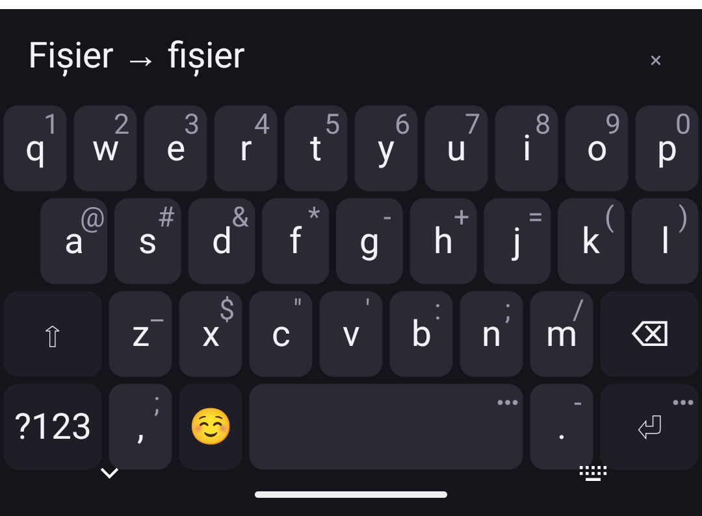
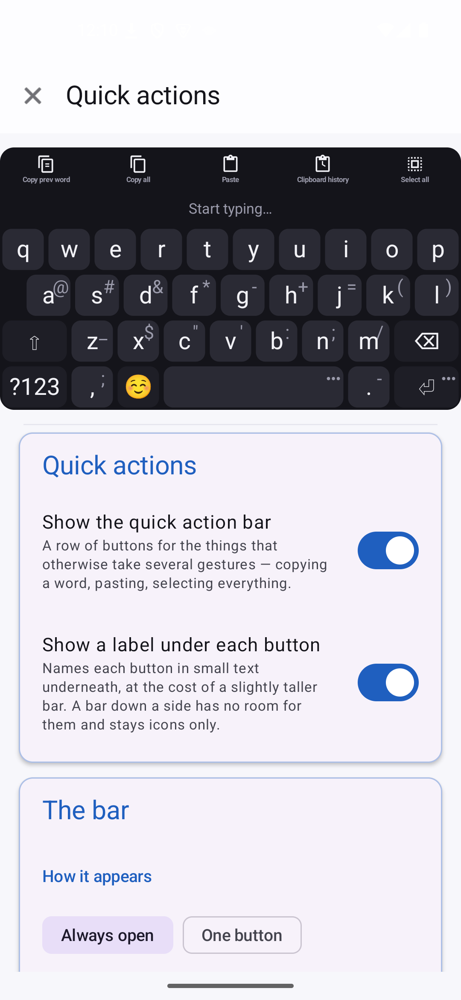
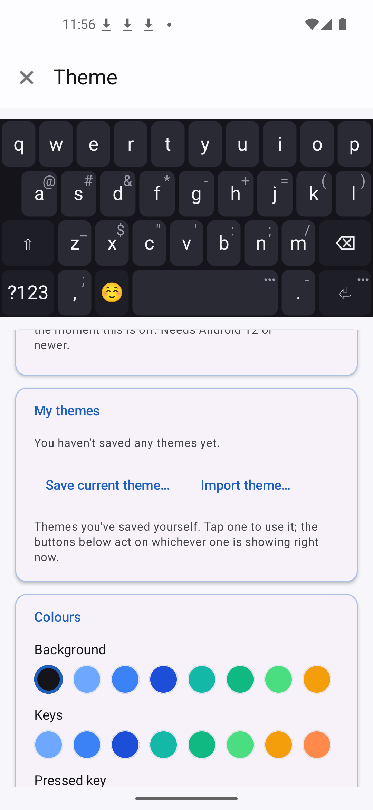
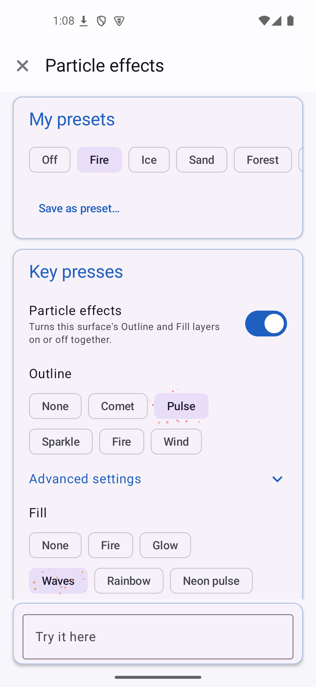
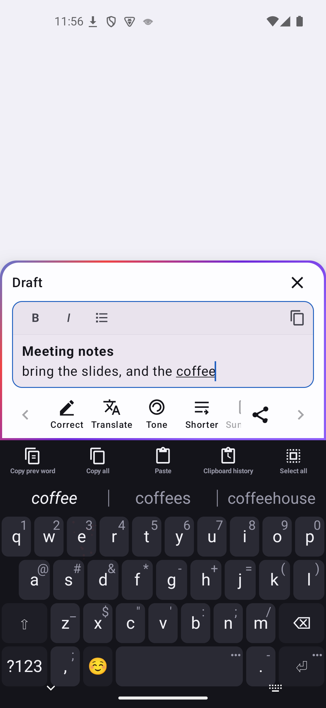
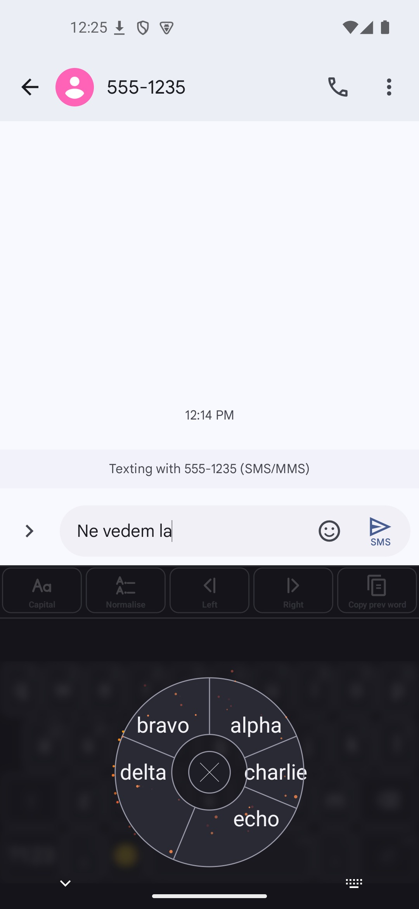
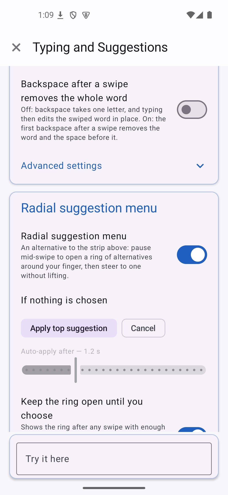
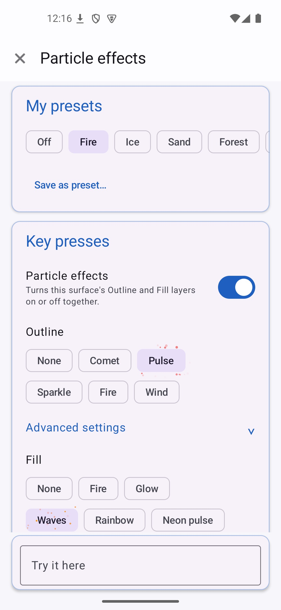
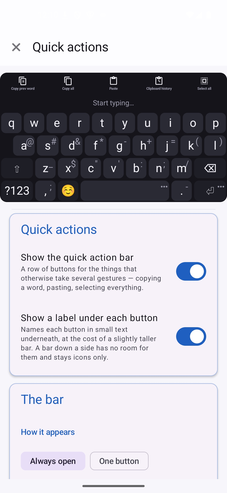

<!--
SPDX-License-Identifier: GPL-3.0-or-later
SPDX-FileCopyrightText: 2026 BorderKeys contributors
-->

<p align="center">
  
</p>

# BorderKeys

An Android keyboard that holds no permissions, opens no sockets, and predicts your next word
with a deterministic engine written in C++.

Nothing here downloads at runtime. Dictionaries and models are either inside the APK or
imported by you from a local file. There is no telemetry, no crash reporting, no account, no
sync. The `core` build contains no machine-learning model of any kind.

Licensed **GPL-3.0-or-later**.

[](https://github.com/razvan-eduard/borderkeys/releases)
[](LICENSE)

**F-Droid repo (custom, third-party):** https://razvan-eduard.github.io/vox-fdroid-repo/repo/

Not yet on the official F-Droid repository — the submission is prepared (see
[`metadata/`](metadata)) but not merged. Until then, add the URL above as a repository in your
F-Droid client to get both builds and their updates. It also carries the other apps from
[VoxApps](https://github.com/razvan-eduard/VoxApps), which is who hosts it. Or install a release
directly from [GitHub Releases](https://github.com/razvan-eduard/borderkeys/releases/latest).

## Features

### Typing

- **Deterministic n-gram prediction and autocorrect**, in C++, on-device. No cloud lookup, no
  per-keystroke telemetry to anyone — the engine is a compiled library, not a service. Where the
  n-grams have no evidence at all, a part-of-speech tag per word and a tag transition matrix
  break the tie; [`docs/pos-tagging.md`](docs/pos-tagging.md) records exactly how much that is
  worth, because the number is smaller than it looks.
- **Several languages active at once.** Every installed dictionary is consulted on every word;
  the one that actually recognises what you typed wins, without a manual switch. How quickly the
  keyboard commits to one language once it has seen enough — off, patient, balanced, quick or
  strict — is a setting.
- **Retroactive correction when the conversation's language turns out to differ.** A correction
  applied while typing can be wrong not because the guess was bad, but because the keyboard read
  the wrong language at the time — the sentence itself proves it a few words later. BorderKeys
  notices the flip and offers the affected word back (or fixes it automatically, your choice),
  landing on the field's own undo history like any other edit.
- **Autocorrect you can bound.** Off by default, and when on: the shortest word it may touch,
  how strict the engine's own ranking has to be, and how different a correction may be from what
  you typed — one letter, two only in long words, or two — are each a setting. A correct word the
  dictionaries simply do not know is left alone rather than replaced by something far away, and
  the backspace straight after a correction puts back exactly what you typed.
- **Capitals and spaces the way every keyboard does them.** Shift is spent by the next letter
  only; two quick taps or a hold lock it. Sentences are capitalised on the field's own request,
  or — a separate switch — even in fields that never made one. Two spaces make a full stop, a
  space is added after punctuation and a picked suggestion, and the space you type out of habit
  right after can be ignored once, always, or kept.
- **Swipe typing**, geometric (SHARK²) and deterministic in both flavors — no model, no training
  data, no accuracy number that depends on what you happened to type it on. A small loop at a
  doubled letter tells "hello" from "helo". Swiping switches itself off in password, e-mail,
  web-address and number fields. `plus` also carries an **experimental neural decoder** — a
  small TCN hand-written in C++ with no ML runtime, its weights trained in this repository on a
  free corpus — as an opt-in switch, off by default; see [Flavors](#flavors).
- **An optional radial menu for swipe typing.** Pause mid-swipe, without lifting, to open a ring
  of alternatives around your finger — slide onto one to pick it, or onto the centre Cancel to
  discard the swipe, all in one continuous motion. Lifting elsewhere applies the top guess or
  cancels, whichever you've set as the default; a "keep it open" option turns the same ring into
  an unhurried, tap-only menu instead. A tap anywhere outside the ring — on the keys, in the text
  field, or elsewhere on the screen — closes it and keeps the swiped word, and can hide the
  keyboard too if you prefer. Position, size and the blur behind it are adjustable. Off by
  default — the ordinary suggestion strip is unchanged either way.
- **A names dictionary** built from Wikidata (CC0), so a name capitalises correctly mid-sentence
  instead of only at the start of one or after a shift — "Sadoveanu" and "Popescu" as much as
  "Andrei". Everyday words that happen to be somebody's name ("in", "will", "si") stay
  lower-case: a word only earns the flag when enough real people carry it for how common the
  word is, and never when the language's own treebank calls it an ordinary word.
- **Alternate physical layouts** — AZERTY, Dvorak, QWERTZ, ClearFlow, KasRoz and Toki Pona — for
  the 26-letter alphabets every bundled dictionary already knows, plus a number row, a symbols
  page with a proper number pad, and a numeric keypad in numeric fields.
- **A personal dictionary you can see and edit.** Every learned word or phrase is listed with
  how often you used it, and a `Forget` (remove it) and a `Block` (never suggest it again) right
  beside it — not a black box. Holding a suggestion offers the same from the keyboard.
- **Private mode is automatic.** In a password field, or wherever an app asks for no personalised
  learning, there is no learning, no clipboard history, no swipe, no ring — and a password's text
  never reaches the prediction engine at all.

<p align="center">
  
</p>

### Quick actions

A row of buttons for what otherwise takes several gestures — copying a word, pasting, selecting
everything — built in, and extendable: a **custom quick action** is a macro of steps you define
yourself, pinned onto the bar exactly like a built-in one. The bar can sit above the suggestions,
below the keys, or down either side; it comes in four sizes, with optional labels under the
buttons, and the settings screen shows the real bar live while you change it.

<p align="center">
  
</p>

### Themes

Built-in themes across several colour families, full manual control over every colour and
corner radius, and a **custom theme library**: save what you built, import a theme someone
shared, export and rename your own — kept separately from whichever single theme is active
right now. Colours picked through the wheel are kept per field, the background can reach the
whole width or stop at the keys, leave the navigation bar's strip bare or paint it, and the
outline frames the whole keyboard rather than each key.

<p align="center">
  
</p>

### Particle effects

Five surfaces — the keys, the suggestion ring, the suggestion strip, the language-correction
panel and the quick-action bar — each with two independent layers: a **fill** that bursts inside
the element (Fire, Glow, Waves, Rainbow, Neon pulse) and an **outline** that traces the element's
own edge and radiates outward (Comet, Pulse, Sparkle, Fire, Wind), with their own colours, speed,
density and width. Every element hands the particle system its exact geometry, so an outline
follows a key, a wedge or a chip precisely and survives any resize. Six built-in looks and your
own saved presets set all five surfaces at once; whatever you change afterwards shows as unsaved
changes against the preset you started from. Off by default.

<p align="center">
  
</p>

### The assistant, `plus` only

A **draft box** — write somewhere the app itself cannot see, then ask an on-device model to
correct, shorten, summarise, re-tone or translate it, with a version kept for every step so
nothing is lost to a bad answer. The box edits rich text: bold, italic and lists from its own
formatting bar, kept as Markdown throughout, and long drafts scroll inside it. Reachable from a
text selection in *any* app through four more entries in the system's own text-selection menu
(Correct, Shorten, Summarise, and any of your own saved instructions), each running immediately
instead of opening an idle box first.

<p align="center">
  
</p>

### Backup, restore, and control

Everything this keyboard has learned and configured — dictionaries, settings, theme, size and
position, particle effects, quick actions, saved instructions — writes to and reads from a
single file, under your control, on your schedule, with a checklist of exactly what a file
contains shown before any of it is applied. The two builds can hand their settings and
dictionaries to each other directly, without a file. Nothing syncs anywhere on its own.

## Two builds, one repository

| | `core` | `plus` |
|---|---|---|
| Deterministic n-gram engine, geometric swipe decoding | ✓ | ✓ |
| Multiple languages active at once, no manual switching | ✓ | ✓ |
| Zero permissions, no `INTERNET` in the merged manifest | ✓ | ✓ |
| Experimental neural swipe decoder, opt-in | | ✓ |
| On-device text assistant (draft box) | | ✓ |

Both stay free software end to end — `plus` only *adds* to `core`, it never trades privacy
for the extra features. The separation is at compile time, not behind a runtime flag: unpack
`app-core-release.apk` and the assistant's code simply is not in it.

Both are published as **separate applications** (`com.borderkeys` and `com.borderkeys.plus`) so
they can be installed side by side — choosing the assistant never costs you the settings or the
learned dictionary of the other build.

## Screenshots

### Typing, in both builds

| Suggestions match the case you typed | Settings | Theme | Several languages at once |
|---|---|---|---|
|  |  |  |  |

### The radial menu and the effects, in both builds

| A ring of alternatives, mid-swipe | What a tap outside the ring does, and the rest | Particle effects | Quick actions, drawn live |
|---|---|---|---|
|  |  |  |  |

### The assistant, `plus` only

| Draft box, with its formatting bar | Working, on-device | A version kept for every step | The models this build will run |
|---|---|---|---|
|  |  |  |  |

## Why the modules are split the way they are

The rule the whole project is arranged around is that Compose must never enter the keyboard's
rendering process. Not "we agreed not to" -- it cannot be imported, because no path in the
dependency graph puts it on `:keyboard`'s classpath, and `verifyKeyboardHasNoCompose` fails
the build if that ever changes.

```
:app ──> :keyboard ──> :data
  │           (no Compose here, in any variant)
  ├──> :settings ──> :data
  │         └──> :keyboard      (theme preview embeds the real keyboard view)
  └──> :assist ──> :data        (plusImplementation: absent from the core APK)
```

| module      | what it is                                                      |
|-------------|-----------------------------------------------------------------|
| `:app`      | Thin application shell. Manifest, flavors, R8, signing. No logic. |
| `:keyboard` | `InputMethodService`, the `Canvas` keyboard view, JNI, the C++ prediction and gesture engines. |
| `:data`     | Room over SQLCipher, typed DataStore. The only place state lives. |
| `:settings` | Every line of Compose in the repository.                          |
| `:assist`   | Local text assistant, own process, `plus` flavor only.            |
| `:i18n`     | Every sentence the app shows, in six languages, as JSON — see [`docs/translations.md`](docs/translations.md). |

## Flavors

| flavor | contains                                                                 |
|--------|--------------------------------------------------------------------------|
| `core` | Deterministic n-gram engine, geometric (SHARK²) swipe decoding. No model files, no neural code, no non-free assets. |
| `plus` | Adds the local text assistant, and the experimental neural swipe decoder with its weights. |

`core` is the default and is the one that stays entirely free software. The separation is at
compile time, not behind a runtime flag: unpack `app-core-release.apk` and the assistant's code
is not in it. The prediction engine is the same code in both builds; `plus` compiles one extra
gesture decoder into it — a small TCN hand-written in C++ with no ML runtime, its weights
trained by [`tools/swipe_model`](tools/swipe_model) on the MIT-licensed `futo-org/swipe.futo.org`
corpus — behind an "Experimental swipe model" switch that is off by default. That makes `plus`
free software too, weights included; see [`docs/licensing.md`](docs/licensing.md) §2.1 and
§2.5 for the provenance and what the other options would have cost.

## Building

Requires JDK 21 (the Gradle daemon provisions it), the Android SDK with platform 37, and
NDK 27.1.12297006.

```bash
./gradlew :app:assembleCoreRelease      # the free build
./gradlew :app:assemblePlusRelease      # with the optional model-backed features
./gradlew test                          # JVM tests, every module
```

Three checks run as part of `assemble` and fail the build rather than warn:

- `verifyNoInternetPermission` — reads the *merged* manifest, so a library that injects
  `INTERNET` during the merge is caught rather than inherited.
- `verifyNoForbiddenDependencies` — walks the release runtime classpath for telemetry, HTTP
  clients and DI containers, transitively.
- `verifyKeyboardHasNoCompose` — walks `:keyboard`'s classpath for any Compose artifact.

The bundled dictionaries are compiled from the word lists in [`dictionaries/`](dictionaries) on
every build; no binary pack is committed. The native engine also builds and tests on the host
(`native-tests/`, a CMake project) in CI, against packs produced by the same compiler.

## Installing on a device

Install the **release** build, never a debug one. A debug build has R8 off and JNI debugging
on, so every latency number this project is built around is meaningless on it.

```bash
./gradlew :app:installCoreRelease
```

That needs a signing key at `~/.borderkeys/borderkeys-release.jks` with its password in
`~/.borderkeys/keystore_password.txt` (or `RELEASE_KEYSTORE_PATH` and
`RELEASE_KEYSTORE_PASSWORD` in the environment, which is how CI supplies it). Without one the
build still succeeds and produces an unsigned APK, so a contributor without the key is never
blocked.

## Verifying the claims yourself

```bash
# Zero permissions. Not "only harmless ones" -- zero.
aapt2 dump permissions app/build/outputs/apk/core/release/app-core-release.apk

# No model files, no assistant classes in the free build.
unzip -l app/build/outputs/apk/core/release/app-core-release.apk
```

Release APKs published from CI carry a build provenance attestation:

```bash
gh attestation verify BorderKeys-v0.6.2-core.apk --repo razvan-eduard/borderkeys
```

## Documentation

- [`docs/licensing.md`](docs/licensing.md) — every dependency and asset, with its licence and
  a compatibility verdict, plus the reproducible-build settings and the F-Droid anti-feature
  checklist.
- [`docs/dictionaries.md`](docs/dictionaries.md) — how a language pack is built from a corpus,
  and how the names list is merged into it.
- [`docs/pos-tagging.md`](docs/pos-tagging.md) — what the grammar tags inside a pack are worth,
  measured.
- [`docs/translations.md`](docs/translations.md) — adding a language or a string to the
  interface.
- [`CONTRIBUTING.md`](CONTRIBUTING.md) — DCO, no CLA.
- [`metadata/`](metadata) — F-Droid submission metadata for both packages;
  [`fastlane/`](fastlane) — the store listings and screenshots the custom repository publishes.
