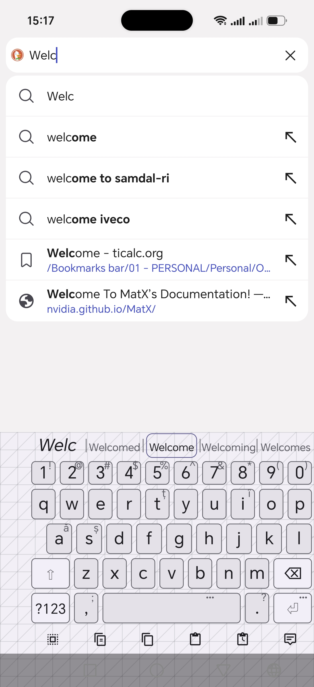
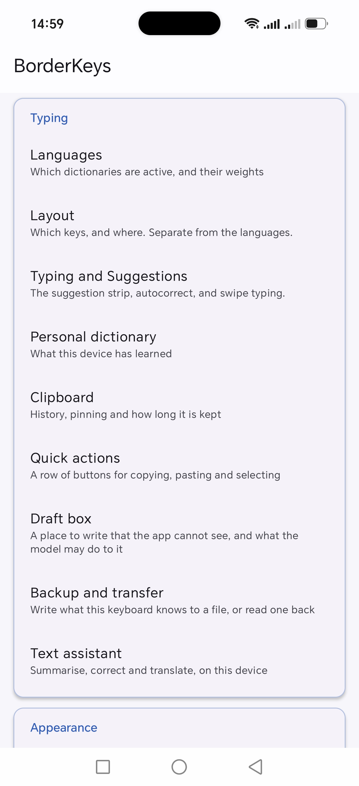
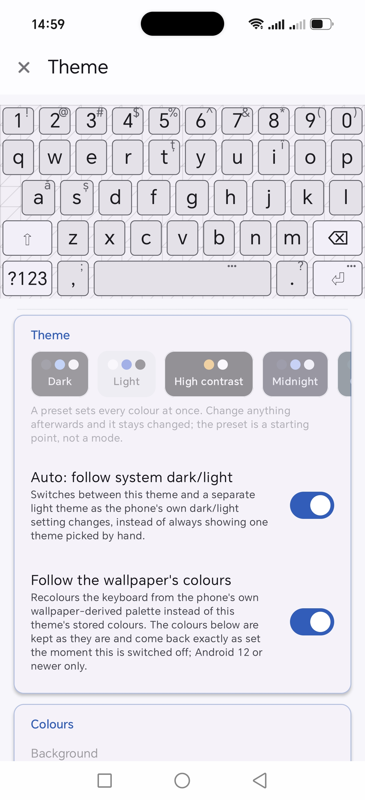
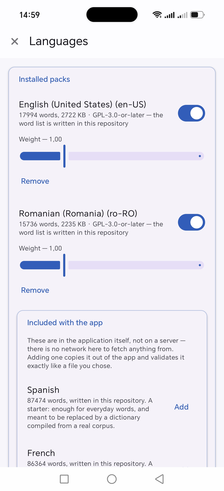
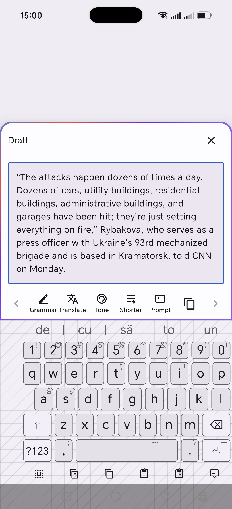
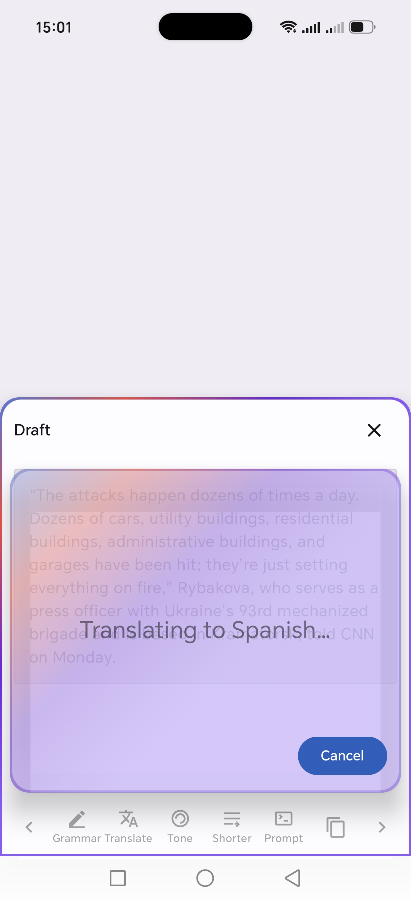
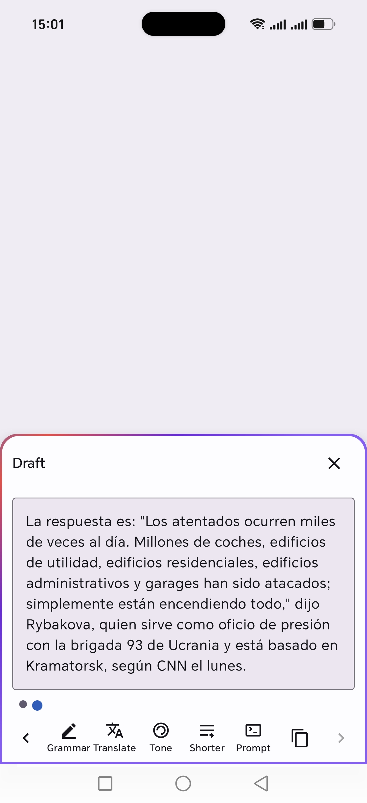
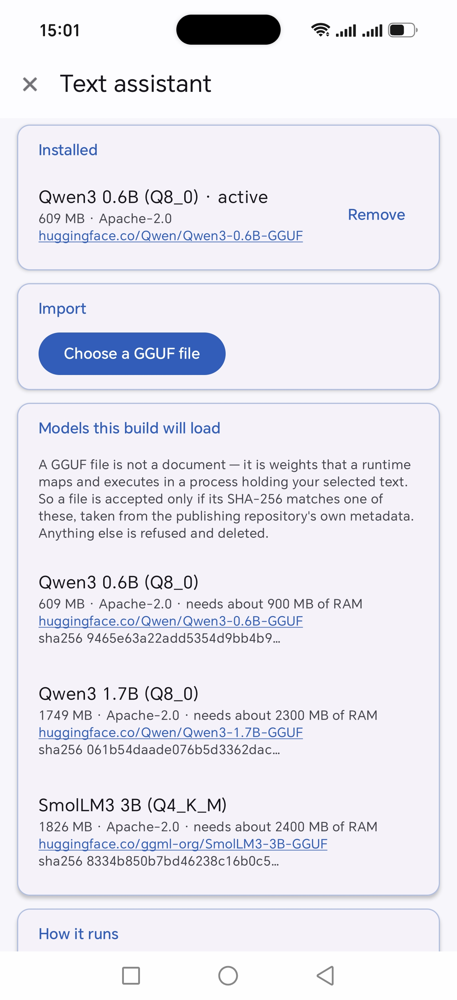

<!--
SPDX-License-Identifier: GPL-3.0-or-later
SPDX-FileCopyrightText: 2026 BorderKeys contributors
-->

<p align="center">
  
</p>

# BorderKeys

An Android keyboard that holds no permissions, opens no sockets, and predicts your next word
with a deterministic engine written in C++.

Nothing here downloads at runtime. Dictionaries and models are either inside the APK or
imported by you from a local file. There is no telemetry, no crash reporting, no account, no
sync. The `core` build contains no machine-learning model of any kind.

Licensed **GPL-3.0-or-later**.

[](https://github.com/razvan-eduard/borderkeys/releases)
[](LICENSE)

## Two builds, one repository

| | `core` | `plus` |
|---|---|---|
| Deterministic n-gram engine, geometric swipe decoding | ✓ | ✓ |
| Multiple languages active at once, no manual switching | ✓ | ✓ |
| Zero permissions, no `INTERNET` in the merged manifest | ✓ | ✓ |
| Neural swipe decoder | | ✓ |
| On-device text assistant (draft box) | | ✓ |

Both stay free software end to end — `plus` only *adds* to `core`, it never trades privacy
for the extra features. The separation is at compile time, not behind a runtime flag: unpack
`app-core-release.apk` and the assistant's code simply is not in it.

Both are published as **separate applications** (`com.borderkeys` and `com.borderkeys.plus`) so
they can be installed side by side — choosing the assistant never costs you the settings or the
learned dictionary of the other build.

## Screenshots

### Typing, in both builds

| Suggestions match the case you typed | Settings | Theme | Several languages at once |
|---|---|---|---|
|  |  |  |  |

### The assistant, `plus` only

| Draft box, opened on a selection | Working, on-device | A version kept for every step | The models this build will run |
|---|---|---|---|
|  |  |  |  |

## Why the modules are split the way they are

The rule the whole project is arranged around is that Compose must never enter the keyboard's
rendering process. Not "we agreed not to" -- it cannot be imported, because no path in the
dependency graph puts it on `:keyboard`'s classpath, and `verifyKeyboardHasNoCompose` fails
the build if that ever changes.

```
:app ──> :keyboard ──> :data
  │           (no Compose here, in any variant)
  ├──> :settings ──> :data
  │         └──> :keyboard      (theme preview embeds the real keyboard view)
  └──> :assist ──> :data        (plusImplementation: absent from the core APK)
```

| module      | what it is                                                      |
|-------------|-----------------------------------------------------------------|
| `:app`      | Thin application shell. Manifest, flavors, R8, signing. No logic. |
| `:keyboard` | `InputMethodService`, the `Canvas` keyboard view, JNI, the C++ prediction and gesture engines. |
| `:data`     | Room over SQLCipher, typed DataStore. The only place state lives. |
| `:settings` | Every line of Compose in the repository.                          |
| `:assist`   | Local text assistant, own process, `plus` flavor only.            |

## Flavors

| flavor | contains                                                                 |
|--------|--------------------------------------------------------------------------|
| `core` | Deterministic n-gram engine, geometric (SHARK²) swipe decoding. No model files, no neural code, no non-free assets. |
| `plus` | Adds the neural swipe decoder and the local text assistant.               |

`core` is the default and is the one that stays entirely free software. The separation is at
compile time, not behind a runtime flag: unpack `app-core-release.apk` and the neural code is
not in it.

## Building

Requires JDK 21 (the Gradle daemon provisions it), the Android SDK with platform 37, and
NDK 27.1.12297006.

```bash
./gradlew :app:assembleCoreRelease      # the free build
./gradlew :app:assemblePlusRelease      # with the optional model-backed features
./gradlew test                          # JVM tests, every module
```

Three checks run as part of `assemble` and fail the build rather than warn:

- `verifyNoInternetPermission` — reads the *merged* manifest, so a library that injects
  `INTERNET` during the merge is caught rather than inherited.
- `verifyNoForbiddenDependencies` — walks the release runtime classpath for telemetry, HTTP
  clients and DI containers, transitively.
- `verifyKeyboardHasNoCompose` — walks `:keyboard`'s classpath for any Compose artifact.

## Installing on a device

Install the **release** build, never a debug one. A debug build has R8 off and JNI debugging
on, so every latency number this project is built around is meaningless on it.

```bash
./gradlew :app:installCoreRelease
```

That needs a signing key at `~/.borderkeys/borderkeys-release.jks` with its password in
`~/.borderkeys/keystore_password.txt` (or `RELEASE_KEYSTORE_PATH` and
`RELEASE_KEYSTORE_PASSWORD` in the environment, which is how CI supplies it). Without one the
build still succeeds and produces an unsigned APK, so a contributor without the key is never
blocked.

## Verifying the claims yourself

```bash
# Zero permissions. Not "only harmless ones" -- zero.
aapt2 dump permissions app/build/outputs/apk/core/release/app-core-release.apk

# No model files, no assistant classes in the free build.
unzip -l app/build/outputs/apk/core/release/app-core-release.apk
```

Release APKs published from CI carry a build provenance attestation:

```bash
gh attestation verify BorderKeys-v0.3.0-core.apk --repo razvan-eduard/borderkeys
```

## Documentation

- [`docs/licensing.md`](docs/licensing.md) — every dependency and asset, with its licence and
  a compatibility verdict, plus the reproducible-build settings and the F-Droid anti-feature
  checklist.
- [`CONTRIBUTING.md`](CONTRIBUTING.md) — DCO, no CLA.
- [`metadata/`](metadata) — F-Droid submission metadata for both packages.
