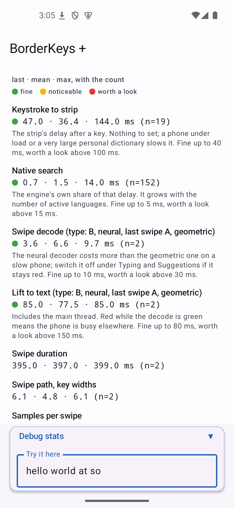

<!--
SPDX-License-Identifier: GPL-3.0-or-later
SPDX-FileCopyrightText: 2026 BorderKeys contributors
-->

<p align="center">
  
</p>

# BorderKeys

An Android keyboard that holds no permissions, opens no sockets, and predicts your next word
with a deterministic engine written in C++.

Nothing here downloads at runtime. Dictionaries and models are either inside the APK or
imported by you from a local file. There is no telemetry, no crash reporting, no account, no
sync. The `core` build contains no machine-learning model of any kind.

Licensed **GPL-3.0-or-later**.

[](https://github.com/razvan-eduard/borderkeys/releases)
[](LICENSE)

**F-Droid repo (custom, third-party):** https://razvan-eduard.github.io/vox-fdroid-repo/repo/

Not yet on the official F-Droid repository — the submission is prepared (see
[`metadata/`](metadata)) but not merged. Until then, add the URL above as a repository in your
F-Droid client to get both builds and their updates. It also carries the other apps from
[VoxApps](https://github.com/razvan-eduard/VoxApps), which is who hosts it. Or install a release
directly from [GitHub Releases](https://github.com/razvan-eduard/borderkeys/releases/latest).

## What it does

The whole walk-through, screen by screen, is [`docs/guide.md`](docs/guide.md). In short:

- **Typing.** Deterministic n-gram prediction and autocorrect in C++, on the device; up to
  four languages active at once, the one that recognises the word winning; retroactive
  correction when the sentence proves the language was misread; autocorrect off by default and
  bounded when on; a names dictionary built from Wikidata; swipe typing that is geometric in
  `core` and neural in `plus`, with an optional ring of alternatives around a paused swipe;
  six languages inside the app and more as packs to download from the releases page;
  AZERTY, Dvorak, QWERTZ and more, a number row, a number pad and a modifier row; a personal
  dictionary you can read and edit, word by word and phrase by phrase, with "Why?" on any
  suggestion; text shortcuts; terminals typed into as terminals.
- **Around the keys.** A quick-action bar for what takes several gestures, extendable with
  macros of your own; themes and a theme library; particle effects on five surfaces; panels
  that search by the word under the caret; a slide on the space bar that moves the caret, by
  character or by line, and selects with shift held; a tile in the quick settings; settings
  with a search box and everything seldom needed folded away.
- **Privacy.** No permission, no socket, no telemetry. Private mode is automatic in password
  fields and wherever an app asks for no personalised learning; the clipboard history never
  keeps a copy the app marked sensitive, one made in a password manager or code app the
  keyboard knows, or one made in an app you name. Everything learned lives in an encrypted
  database on the phone, writes to a backup file only on your say, and moves between the two
  builds directly.
- **The assistant, `plus` only.** A draft box the app cannot see, and an on-device model that
  corrects, shortens, summarises, re-tones or translates it, reachable from any text selection.

<p align="center">
  
  
</p>

## Two builds, one repository

| | `core` | `plus` |
|---|---|---|
| Deterministic n-gram engine, geometric swipe decoding | ✓ | ✓ |
| Multiple languages active at once, no manual switching | ✓ | ✓ |
| Zero permissions, no `INTERNET` in the merged manifest | ✓ | ✓ |
| Neural swipe decoder, on by default, switchable | | ✓ |
| On-device text assistant (draft box) | | ✓ |
| Correct, Shorten, Summarise and your own instructions in every app's text-selection menu | | ✓ |

Both stay free software end to end — `plus` only *adds* to `core`, it never trades privacy
for the extra features. The separation is at compile time, not behind a runtime flag: unpack
`app-core-release.apk` and the assistant's code simply is not in it.

Both are published as **separate applications** (`com.borderkeys` and `com.borderkeys.plus`) so
they can be installed side by side — choosing the assistant never costs you the settings or the
learned dictionary of the other build.

## Why the modules are split the way they are

The rule the whole project is arranged around is that Compose must never enter the keyboard's
rendering process. Not "we agreed not to" -- it cannot be imported, because no path in the
dependency graph puts it on `:keyboard`'s classpath, and `verifyKeyboardHasNoCompose` fails
the build if that ever changes.

```
:app ──> :keyboard ──> :data
  │           (no Compose here, in any variant)
  ├──> :settings ──> :data
  │         └──> :keyboard      (theme preview embeds the real keyboard view)
  └──> :assist ──> :data        (plusImplementation: absent from the core APK)
```

| module      | what it is                                                      |
|-------------|-----------------------------------------------------------------|
| `:app`      | Thin application shell. Manifest, flavors, R8, signing. No logic. |
| `:keyboard` | `InputMethodService`, the `Canvas` keyboard view, JNI, the C++ prediction and gesture engines. |
| `:data`     | Room over SQLCipher, typed DataStore. The only place state lives. |
| `:settings` | Every line of Compose in the repository.                          |
| `:assist`   | Local text assistant, own process, `plus` flavor only.            |
| `:i18n`     | Every sentence the app shows, in six languages, as JSON — see [`docs/translations.md`](docs/translations.md). |

## Flavors

| flavor | contains                                                                 |
|--------|--------------------------------------------------------------------------|
| `core` | Deterministic n-gram engine, geometric (SHARK²) swipe decoding. No model files, no neural code, no non-free assets. |
| `plus` | Adds the local text assistant, and the experimental neural swipe decoder with its weights. |

`core` is the default and is the one that stays entirely free software. The separation is at
compile time, not behind a runtime flag: unpack `app-core-release.apk` and the assistant's code
is not in it. The prediction engine is the same code in both builds; `plus` compiles one extra
gesture decoder into it — a small TCN hand-written in C++ with no ML runtime, its weights
trained by [`tools/swipe_model`](tools/swipe_model) on the MIT-licensed `futo-org/swipe.futo.org`
corpus — behind a "Neural swipe model" switch that is on by default. That makes `plus`
free software too, weights included; see [`docs/licensing.md`](docs/licensing.md) §2.1 and
§2.5 for the provenance and what the other options would have cost.

## Building

Requires JDK 21 (the Gradle daemon provisions it), the Android SDK with platform 37, and
NDK 27.1.12297006. The keyboard runs on Android 11 (API 30) and later: inline autofill
suggestions, which are how password managers reach the strip, need that level, and the floor is
recorded in `gradle/libs.versions.toml`.

```bash
./gradlew :app:assembleCoreRelease      # the free build
./gradlew :app:assemblePlusRelease      # with the optional model-backed features
./gradlew test                          # JVM tests, every module
```

Three checks run as part of `assemble` and fail the build rather than warn:

- `verifyNoInternetPermission` — reads the *merged* manifest, so a library that injects
  `INTERNET` during the merge is caught rather than inherited. On `core` it also refuses the
  assistant's four text-selection entries, so the free build never advertises a Correct,
  Shorten, Summarise or custom action it cannot run.
- `verifyNoForbiddenDependencies` — walks the release runtime classpath for telemetry, HTTP
  clients and DI containers, transitively.
- `verifyKeyboardHasNoCompose` — walks `:keyboard`'s classpath for any Compose artifact.

The bundled dictionaries are compiled from the word lists in [`dictionaries/`](dictionaries) on
every build; no binary pack is committed. The native engine also builds and tests on the host
(`native-tests/`, a CMake project) in CI, against packs produced by the same compiler.

## Installing on a device

Install the **release** build, never a debug one. A debug build has R8 off and JNI debugging
on, so every latency number this project is built around is meaningless on it.

```bash
./gradlew :app:installCoreRelease
```

That needs a signing key at `~/.borderkeys/borderkeys-release.jks` with its password in
`~/.borderkeys/keystore_password.txt` (or `RELEASE_KEYSTORE_PATH` and
`RELEASE_KEYSTORE_PASSWORD` in the environment, which is how CI supplies it). Without one the
build still succeeds and produces an unsigned APK, so a contributor without the key is never
blocked.

## Verifying the claims yourself

The settings application measures the keyboard as it runs. The **Debug stats** line above its
"Try it here" field opens a panel with the keystroke-to-strip and native search latency, the
swipe decode and lift-to-text figures labelled with the decoder that ran, the swipe's duration,
path and samples, the pack load time, typing speed and process memory — each as last, mean and
maximum, rated against a baseline with a line on what changes it — and a Share button that hands
the panel to any app as text. The figures in [`docs/testing.md`](docs/testing.md) come from it.

<p align="center">
  
</p>

```bash
# Zero permissions. Not "only harmless ones" -- zero.
aapt2 dump permissions app/build/outputs/apk/core/release/app-core-release.apk

# No model files, no assistant classes in the free build.
unzip -l app/build/outputs/apk/core/release/app-core-release.apk
```

Release APKs published from CI carry a build provenance attestation:

```bash
gh attestation verify BorderKeys-v0.6.2-core.apk --repo razvan-eduard/borderkeys
```

## Documentation

- [`docs/architecture.md`](docs/architecture.md) — what each module is and what happens between a
  finger and a word: the suggestion and learning paths, why autocorrect and the suggestion strip
  rank separately, every scoring constant with the measurement behind it, the gates that stop a
  correction, language detection and revert, both swipe tiers, and the dictionary pipeline.
- [`docs/privacy.md`](docs/privacy.md) — what the keyboard can and cannot know: the three things
  that enforce zero permissions, how a private field is detected and what stops learning from it,
  what encryption at rest does *not* buy, and a threat model with both columns filled in.
- [`docs/layouts.md`](docs/layouts.md) — the layout asset format, key codes and flags, how JSON
  becomes hit-testable pixels, and why accents follow your languages rather than your layout.
- [`docs/testing.md`](docs/testing.md) — tests, build gates, sanitisers and fuzzing, the
  measurements that are deliberately not tests, and what is not covered.
- [`docs/licensing.md`](docs/licensing.md) — every dependency and asset, with its licence and
  a compatibility verdict, plus the reproducible-build settings and the F-Droid anti-feature
  checklist.
- [`docs/guide.md`](docs/guide.md) — the user guide: what every part of the keyboard does and
  where it is switched on, with the store screenshots.
- [`docs/dictionaries.md`](docs/dictionaries.md) — how a language pack is built from a corpus,
  how the names list is merged into it, and what the offensive-word lists behind the "Block
  offensive words" switch do and do not cover.
- [`docs/pos-tagging.md`](docs/pos-tagging.md) — what the grammar tags inside a pack are worth,
  measured.
- [`docs/translations.md`](docs/translations.md) — adding a language or a string to the
  interface.
- [`CONTRIBUTING.md`](CONTRIBUTING.md) — DCO, no CLA. [`CODE_OF_CONDUCT.md`](CODE_OF_CONDUCT.md)
  — what is expected wherever the project is discussed. [`SECURITY.md`](SECURITY.md) — how to
  report a vulnerability, and what counts as one. [`CHANGELOG.md`](CHANGELOG.md) — what each
  release changed, and what is on the way. [`CITATION.cff`](CITATION.cff) — how to cite the
  project.
- [`metadata/`](metadata) — F-Droid submission metadata for both packages;
  [`fastlane/`](fastlane) — the store listings and screenshots the custom repository publishes.
