<!--
SPDX-License-Identifier: GPL-3.0-or-later
SPDX-FileCopyrightText: 2026 BorderKeys contributors
-->

# The BorderKeys guide

What the keyboard does, part by part, with the screenshots from the store listing: typing and
its settings, the quick-action bar, themes, particle effects, the assistant of the `plus`
build, and backup. Every switch named here is on the settings screen the paragraph says, and
the search box at the top of the settings home finds it by name. The [README](../README.md)
holds the promises the project makes and how to verify them; this page is how to use what it
ships.

## Typing

- **Deterministic n-gram prediction and autocorrect**, in C++, on-device. No cloud lookup, no
  per-keystroke telemetry to anyone — the engine is a compiled library, not a service. Where the
  n-grams have no evidence at all, a part-of-speech tag per word and a tag transition matrix
  break the tie; [`pos-tagging.md`](pos-tagging.md) records exactly how much that is
  worth, because the number is smaller than it looks.

  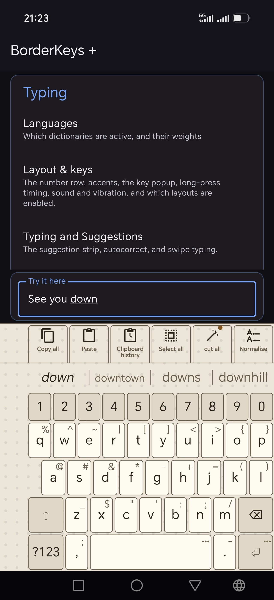

- **Several languages active at once.** Every dictionary you have switched on — up to four at a
  time — is consulted on every word; the one that actually recognises what you typed wins,
  without a manual switch. Six languages are inside the app; packs for more, built the same
  way, are on the releases page, and the "More languages" card on the Languages screen says
  how to bring one in. How quickly the
  keyboard commits to one language once it has seen enough — off, patient, balanced, quick or
  strict — is a setting. You can also mark one language **preferred**, and it answers first
  until the words you type say otherwise: it decides where guessing starts, never what wins, so
  a couple of words in another language still switch to it.

  

- **Retroactive correction when the conversation's language turns out to differ.** A correction
  applied while typing can be wrong not because the guess was bad, but because the keyboard read
  the wrong language at the time — the sentence itself proves it a few words later. BorderKeys
  notices the flip and offers the affected word back (or fixes it automatically, your choice),
  landing on the field's own undo history like any other edit.

- **Autocorrect you can bound.** Off by default, and when on: the shortest word it may touch,
  how strict the engine's own ranking has to be, and how different a correction may be from what
  you typed — one letter, two only in long words, or two — are each a setting. A correct word the
  dictionaries simply do not know is left alone rather than replaced by something far away, and
  the backspace straight after a correction puts back exactly what you typed.
- **Offensive words, blocked on request.** One switch keeps a per-language list of profanity
  and slurs out of suggestions, corrections and learning. What you type yourself is never
  touched, and the lists are plain text in the repository, one per bundled language.
- **Capitals and spaces the way every keyboard does them.** Shift is spent by the next letter
  only; two quick taps or a hold lock it. Capitals are off, on when the field asks for them, or
  on everywhere — one choice, since some apps forget to ask. Two spaces make a full stop, a
  space is added after punctuation and a picked suggestion (never in an e-mail or web-address
  field), and the space you type out of habit right after can be ignored once, always, or
  kept. The capital after a full stop is decided
  from what the keyboard just wrote, so it comes even in apps whose editor answers late.

  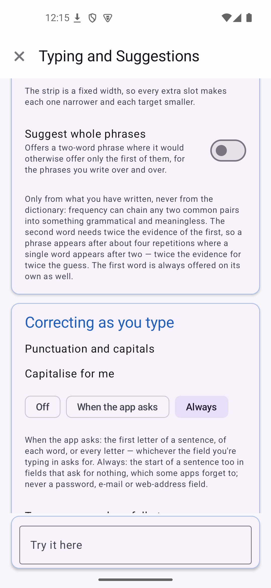

- **Swipe typing.** Geometric (SHARK²) and deterministic in `core` — no model, no training
  data, no accuracy number that depends on what you happened to type it on. A small loop at a
  doubled letter tells "hello" from "helo". Swiping works wherever suggestions do, and switches
  itself off in exactly one place: a password field, whose text never reaches the engine at all.
  `plus` adds a **neural decoder** — a small TCN hand-written in C++ with no ML runtime, its
  weights trained in this repository on a free corpus — and uses it by default, because on the
  same 500 recorded swipes it reads 90.6% first-try against the geometric tier's 77.0%; see
  [Flavors](../README.md#flavors). A switch turns it off, and its weights are freed the moment it goes off,
  so `plus` with the switch off costs no more than `core`.
- **An optional radial menu for swipe typing.** Pause mid-swipe, without lifting, to open a ring
  of alternatives around your finger — slide onto one to pick it, or onto the centre Cancel to
  discard the swipe, all in one continuous motion. Lifting elsewhere applies the top guess or
  cancels, whichever you've set as the default; a "keep it open" option turns the same ring into
  an unhurried, tap-only menu instead. A tap anywhere outside the ring — on the keys, in the text
  field, or elsewhere on the screen — closes it and keeps the swiped word, and can hide the
  keyboard too if you prefer. Position, size and the blur behind it are adjustable. Off by
  default — the ordinary suggestion strip is unchanged either way.

  
  

- **A names dictionary** built from Wikidata (CC0), so a name capitalises correctly mid-sentence
  instead of only at the start of one or after a shift — "Stevens" and "McConnell" as much as
  "Steve". Everyday words that happen to be somebody's name ("in", "will", "cloud", "mark") stay
  lower-case: a word only earns the flag when enough real people carry it for how common the
  word is, never when the language's own treebank calls it an ordinary word, and never when any
  of the shipped spelling dictionaries lists it in lower case unless the treebank knows better.
  That last rule asks every language rather than only the one being built, because words travel
  and a borrowed one rarely becomes a headword where it landed: "google" keeps its small g
  because British English has it as a verb, even though American English lists only the company.
  Which words earn the flag is judgement rather than fact, so the capital is a switch: turn
  "Capitalise names" off and a flagged word is cased like any other, while still never being
  allowed to correct an ordinary word.

  

- **Alternate physical layouts** — AZERTY, Dvorak, QWERTZ, Colemak, Colemak-DH, Workman, Bépo,
  ClearFlow, KasRoz and Toki Pona, the two Turkish arrangements, and the Spanish, Portuguese,
  Nordic, Danish and Norwegian, German, Czech and Hungarian variants that carry their extra
  letters as keys, Russian, Ukrainian, Bulgarian, Serbian, Macedonian, Greek, Armenian and
  Georgian in their own scripts, and Hebrew and Arabic, read from the right with the strip and
  the ring following — for the alphabets the dictionaries know, plus a number row, a symbols
  page with a proper number pad — a 3×3 block at the right or the left with the symbols beside
  it, or a plain digit row — a numeric keypad in numeric fields, and an optional modifier
  row — Esc, Tab, Ctrl, Alt and the arrows, with Home, End, Page up, Page down, forward Delete
  and Insert on offer, in the order you choose, sent as the hardware keys they name, above the
  letters or below the keyboard — for terminals and editors. Ctrl and Alt apply to the next key,
  and with shift held the caret keys select.

  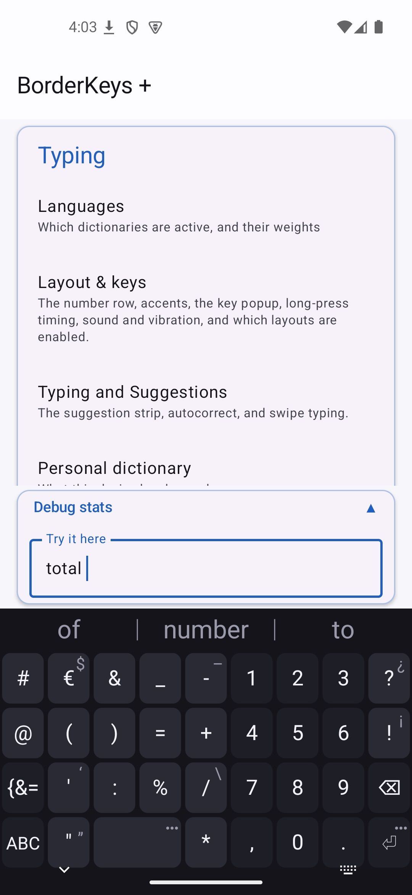
  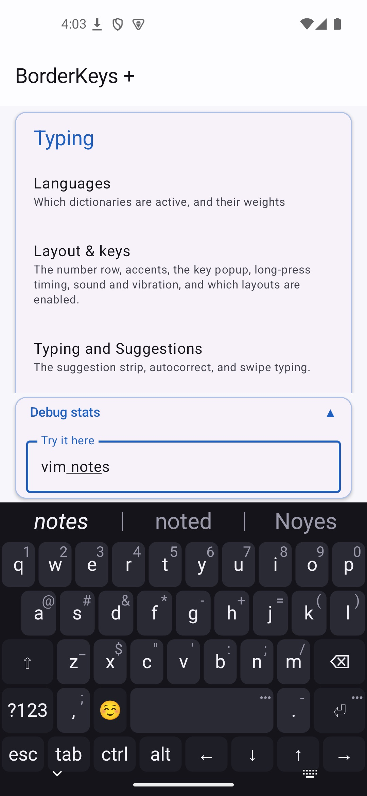
  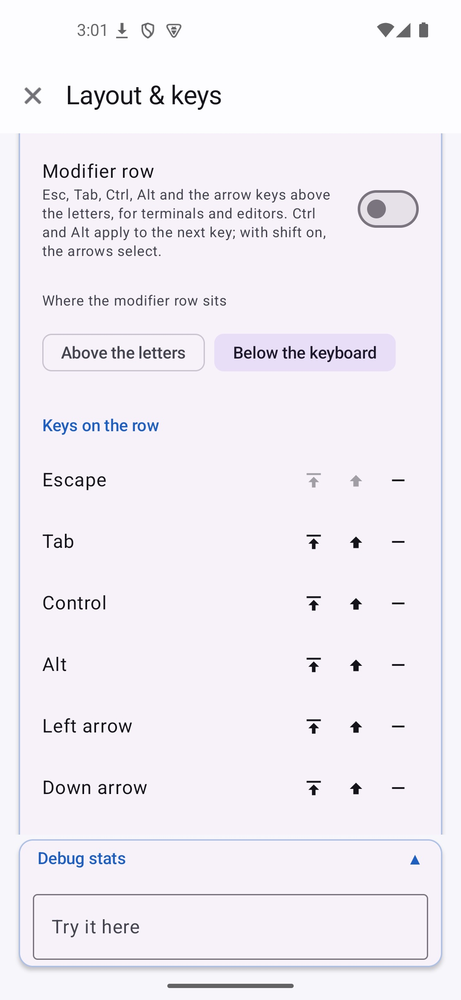

- **A personal dictionary you can see and edit.** Every learned word is listed with how often
  you used it, and a `Forget` (remove it) and a `Block` (never suggest it again) right beside
  it — not a black box. The word pairs and triples it learned are listed on the same screen, each
  with a Forget of its own, and go with a word when it is forgotten. Holding a suggestion offers the same from the keyboard, and a
  "Why?": the engine's own account of the word's score, term by term, in plain words.
- **Terminals typed into as terminals.** In Termux, ConnectBot, JuiceSSH, Termius and any field
  that declares no text class at all, every key types straight through: a character is written
  the moment it is pressed, never held as composing text, a backspace deletes one character,
  and nothing is corrected or learned. The strip still completes the word being typed and a
  swipe still writes one, replaced from the strip like anywhere else.
- **Text shortcuts.** A word that stands for a longer text — "omw" for "on my way", an address, a
  sign-off — expands when a space or a punctuation mark follows it, takes the capital you gave the
  shortcut, and comes back with the backspace straight after, like any other correction.

  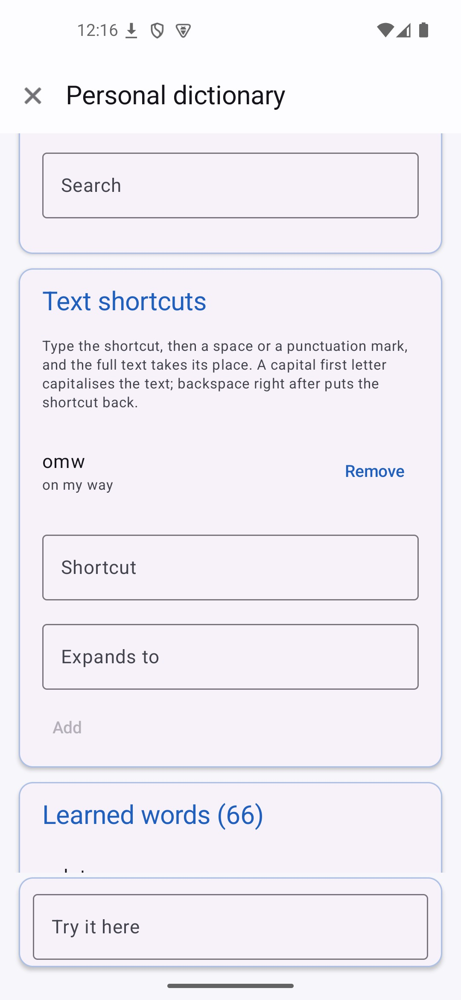

- **Keys that answer back.** The pressed key shows itself enlarged above your finger while it is
  held, the held key's alternates pop up in the same place, and the keypress vibration follows
  the phone's own setting or one of three strengths — its own feedback classes, so still without
  a vibration permission — with a switch each for the keys, for picks on the strip and in the
  panels, and for the swipe ring. Long-press hints, the hold duration and what the enter key does are
  settings too.

  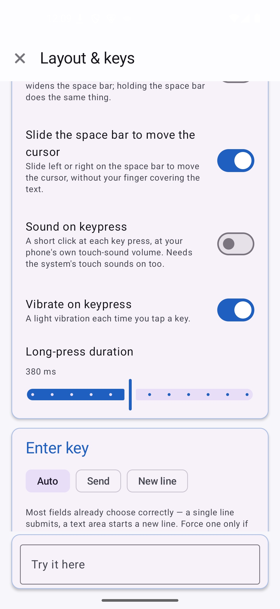

- **Settings that stay out of the way.** Every card leads with what changes how typing feels;
  the calibration values, the workarounds for particular apps and the choices made once fold
  under an "Advanced settings" line, closed until you open it. A search box at the top of the
  home screen finds any screen, card or row by its title, in the language the app is shown in,
  and opens the screen it is on.
- **A tile in the quick settings.** It is lit while BorderKeys is the keyboard in use and says
  what is still to do while it is not; a tap opens the keyboard picker until it is, and the
  settings once it is. The system binds the tile as it binds the keyboard itself, so the app
  still asks for no permission.

  

- **Panels that search by the word under the caret.** Open the emoji panel over "cake" and the
  cakes come first, and over "pumpkin" the lantern, because each emoji is also found by the
  keywords Unicode gives it in the languages switched on; open the clipboard over "invoice" and
  the clips containing it come first, the
  header saying how many. A long press on a clip pins, edits or deletes it, and the Clipboard
  settings screen has a search box and an editor of its own; the box takes plain text, wildcards
  or a regular expression. A copy made in a password manager or one-time-code app the keyboard
  knows, or in an app you name, is never kept.

  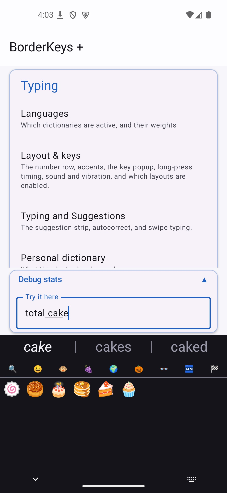
  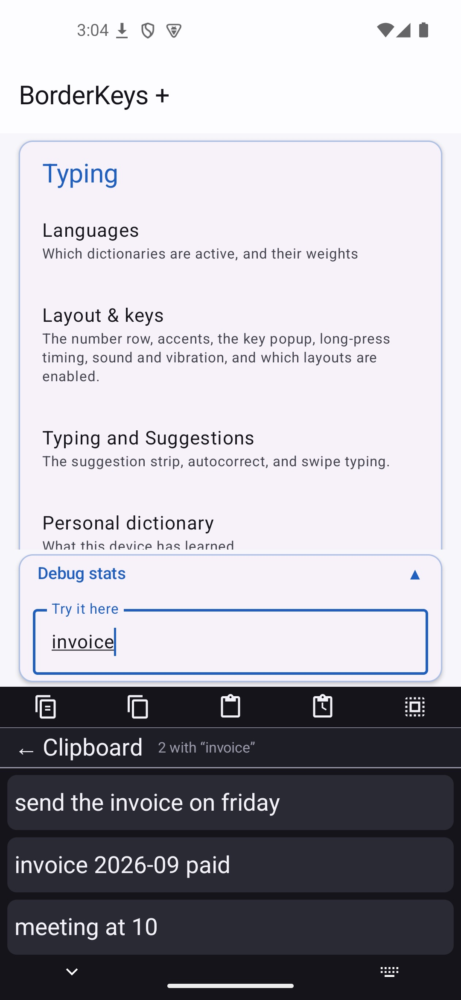

- **A tour after setup.** Once the keyboard is selected, a screen lists what it can do, each
  feature with a small preview, its default and the screen it is switched on from, which a tap
  on the card opens; it can be dismissed for good and reopened from the About card on the
  settings home.

  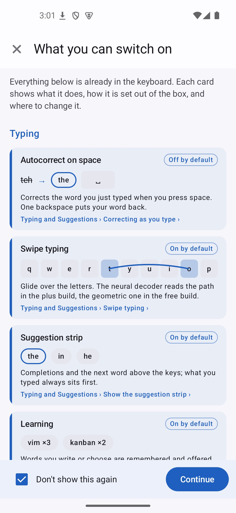

- **Private mode is automatic.** In a password field, or wherever an app asks for no personalised
  learning, there is no learning, no clipboard history, no assistant, and nothing from your
  personal dictionary in the suggestions — and a password's text never reaches the prediction
  engine at all. The strip offers a Show button there instead, so what the field holds can be
  checked and hidden again without leaving the keyboard.

  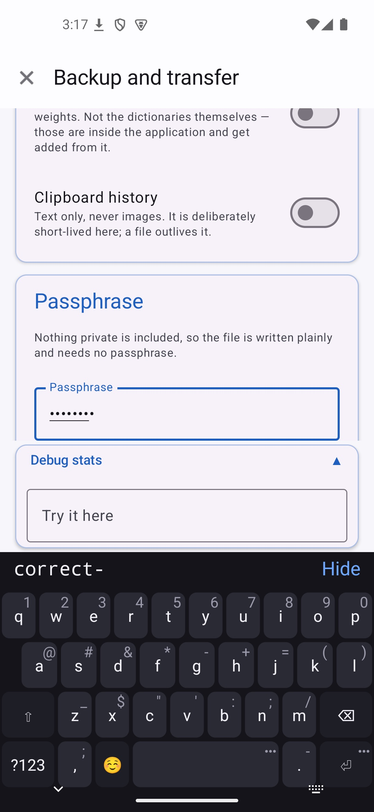

## Quick actions

A row of buttons for what otherwise takes several gestures — copying a word, a line or
everything, pasting, cutting, selecting a word or all of it, deleting a word, moving the cursor to
either end or one character left or right, undo and redo, a new line, the date and time in a
pattern you choose — plus two edits on the text itself: **Capital** flips the first letter of the
word at the cursor, **Normalise** capitalises the start of every sentence in the field. Built in, and extendable: a **custom quick action** is
a macro of steps you define yourself, pinned onto the bar exactly like a built-in one. The bar
can sit above the suggestions, below the keys, or down either side; it comes in four sizes, with
optional labels under the buttons and an outline around each whenever the theme outlines the
keys — and the settings screen shows the real bar live while you change it.

  

## Themes

Built-in themes across several colour families, full manual control over every colour and
corner radius, and a **custom theme library**: save what you built, import a theme someone
shared, export and rename your own — kept separately from whichever single theme is active
right now. Colours picked through the wheel are kept per field, the background can reach the
whole width or stop at the keys, leave the navigation bar's strip bare or paint it, an opacity
slider lets the app behind show through the whole keyboard, and the key
outline follows every key-shaped control — the keys, the held-key popup, the panel chips — and
frames the whole keyboard.

| The theme screen, the keyboard drawn live | Presets, then the colours |
|---|---|
|  |  |

## Particle effects

Five surfaces — the keys, the suggestion ring, the suggestion strip, the language-correction
panel and the quick-action bar — each with two independent layers: a **fill** that bursts inside
the element (Fire, Glow, Waves, Rainbow, Neon pulse) and an **outline** that traces the element's
own edge and radiates outward (Comet, Pulse, Sparkle, Fire, Wind), with their own colours, speed,
density and width. Every element hands the particle system its exact geometry, so an outline
follows a key, a wedge or a chip precisely and survives any resize. Six built-in looks — Off is
one of them — and your own saved presets set all five surfaces at once; whatever you change
afterwards shows as unsaved changes against the preset you started from, and each layer's colours
and dials sit under its own Advanced fold. Off by default.

| Presets, then each surface's layers | A layer unfolded: colours and dials |
|---|---|
|  | 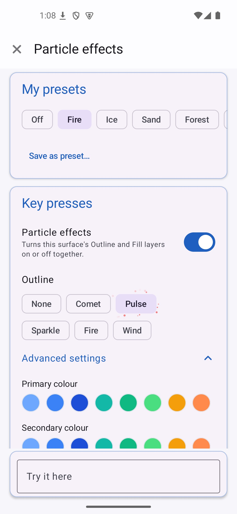 |

## The assistant, `plus` only

A **draft box** — write somewhere the app itself cannot see, then ask an on-device model to
correct, shorten, summarise, re-tone or translate it, with a version kept for every step so
nothing is lost to a bad answer. The box edits rich text: bold, italic and lists from its own
formatting bar, kept as Markdown throughout, and long drafts scroll inside it. Reachable from a
text selection in *any* app through four more entries in the system's own text-selection menu
(Correct, Shorten, Summarise, and any of your own saved instructions), each running immediately
instead of opening an idle box first.

| Draft box, with its formatting bar | Working, on-device | A version kept for every step | The models this build will run |
|---|---|---|---|
|  |  |  |  |

## Backup, restore, and control

Everything this keyboard has learned and configured — dictionaries, settings, theme, size and
position, particle effects, quick actions, text shortcuts, saved instructions — writes to and
reads from a
single file, under your control, on your schedule, with a checklist of exactly what a file
contains shown before any of it is applied. The two builds can hand their settings and
dictionaries to each other directly, without a file. Nothing syncs anywhere on its own.
